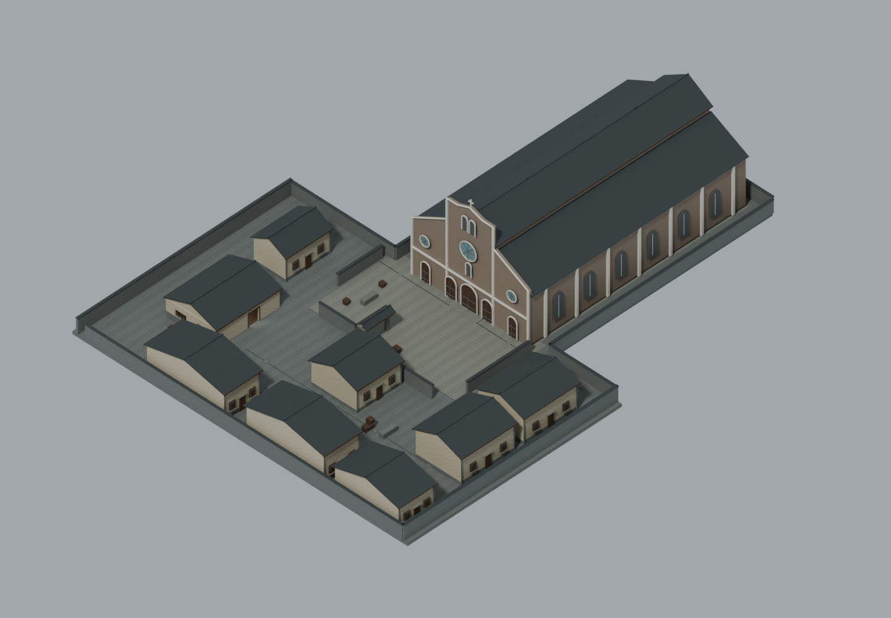
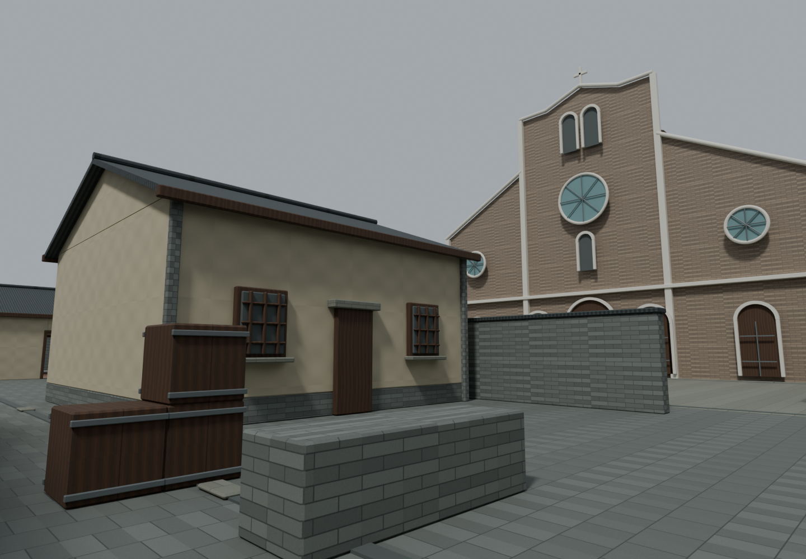
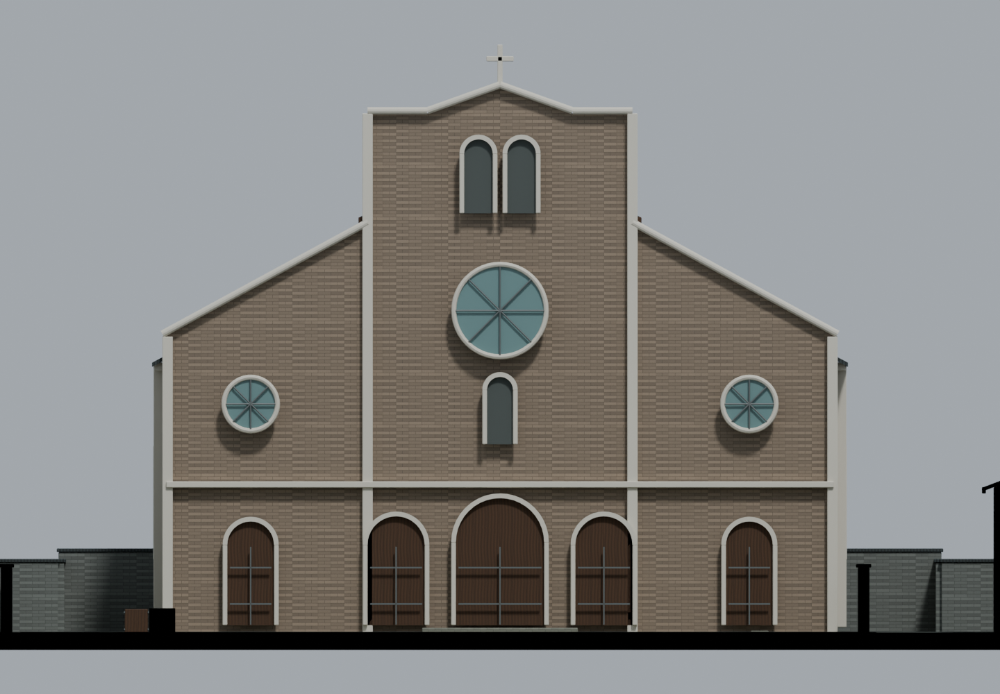
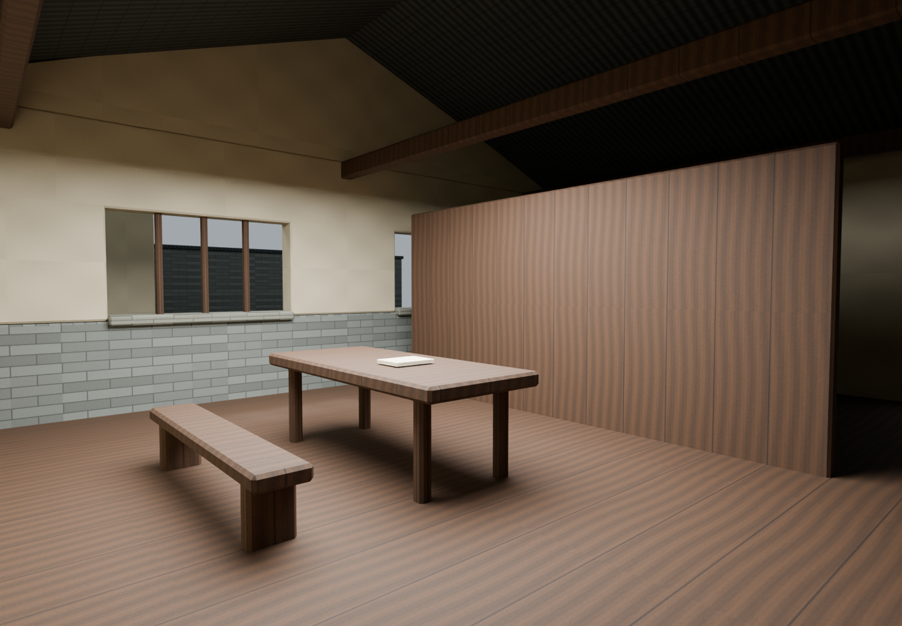

# 松柏巷独立地图资产 v1

目标引擎保持 **LayaAir 3.4.1**。本轮只交付环境资产，`Demo01.ls`、`Scene.ls`、默认启动设置、角色、武器和玩法脚本不变。

## 打开与文件

- 可编辑源文件：`source-assets/environment/songbaix/Songbaix_Block.blend`，由本机 Blender 5.2 实际生成并重新打开检查。材质图片已打包进 blend；可脱离生成脚本打开。
- 运行资产：`assets/resources/environment/songbaix/` 中 `ground.glb`、`landmark.glb`、`street-buildings.glb`、`mission-building.glb`、`props.glb`，以及可选的 `collision-proxies.glb`。
- 贴图：同目录 `textures/`，7张512×512原创PNG。GLB也嵌入其使用的贴图，不依赖外部绝对路径。颜色纹理使用sRGB，表面粗糙度和非金属参数为标准PBR常量。没有 Blender 专用程序节点需要运行时解释。
- 构建源：`source-assets/environment/songbaix/build_songbaix.py`。它只是可重复编辑的生成入口，不能替代已交付的模型。
- 检查源及结果：同目录 `check_songbaix.py`、`validation.json`、`model-stats.json`、`layout.json`。
- 资料与年代边界：[`map-songbaix-references.md`](map-songbaix-references.md)。未确认1927年平面；教堂细部和全部街区布局中未经证实部分已标为估算或游戏补全。

## 组织与坐标

Blender使用米制，1单位=1米；+X暂定东、+Y暂定北、+Z向上，教堂主立面朝-X。原点在教堂西侧前院参考位置 `(0,0,0)`，不是现实经纬度控制点。所有模块共享该原点，**不要分别自动居中或归一化尺寸**。

GLB按glTF标准Y-up导出，对应 `(X,Y,Z)_Blender → (X,Z,-Y)_glTF`。多个模块以单位缩放、零旋转、零平移导入可恢复组合。后续接入LayaAir时应使用引擎的glTF坐标转换，避免手动再旋转一次。目标版本来自工程 `NanChangDemo.laya` 的3.4.1，本轮未改版本，也未保存IDE场景。

源文件保留地面、地标、街巷建筑、虚构任务建筑、道具、碰撞代理、路线与尺度辅助、检查灯光八个Collection。重复盒体构件按尺寸及材质共享网格。门窗、屋面、墙体和家具可分别编辑；没有合成一个整图网格，也没有逐砖逐瓦堆物体。UV0使用可平铺纹理，允许超出0～1；不是独立光照贴图UV。后续若烘焙静态光照需另做UV1。

地图采用收紧的L形边界，包含入口小巷、首个街口、转角通道、前院、天主堂外观、北侧虚构任务建筑和撤离巷。`91_LayoutAndScale` 的路点及标记仅用于后续布局参考，未导出为游戏任务逻辑。四名敌人沿用既有玩法概念，本轮没有生成或重定位任何敌人。

任务建筑有真实前后门洞及侧窗开口，可步入；教堂和普通背景民居为不可进入外壳。空白文件道具只是可替换的视觉占位，不包含历史公文或脚本。门洞名义宽2.4米、地面至过梁2.8米，室内木地板抬高3厘米后有效净高约2.77米。参照现有 `PlayerController.ts` 的2米站高、0.45米半径及1.65米眼高；不把游戏角色尺度作为历史测量依据。

`collision-proxies.glb` 仅为后续设置BoxCollider的命名网格，不能把它当作已配置的引擎物理碰撞。源Collection默认在视口隐藏且不参与渲染；使用时需显式启用。代理覆盖主要静态墙、地面和阻挡，不为每条窗框/小道具增加精细碰撞。

## 实际模型图

下列四张图均由保存模型的实际几何及材质渲染，非概念图。使用清楚的检查照明；1927年8月1日凌晨的夜间氛围待地图接入后再做。

| 鸟瞰 | 街口（1.65米眼高） |
| --- | --- |
|  |  |
| 地标立面 | 虚构任务建筑内部 |
|  |  |

## 检查范围

最终资产检查结果：**PASS**。5个可见模块共516个网格对象、25,096个三角面；碰撞代理57个对象、684个三角面。7张纹理已打包；6个GLB均实际重导入成功，包围盒最大误差小于0.001米。源网格未检出退化面、非流形边、非有限顶点或负整体体积；设计路线静态代理间隙检查通过。四张最终渲染图均已人工视觉查看并修正铺地重叠、室内检查照明和取景遮挡。

`validation.json` 记录最终实际检查结果。检查重新打开blend、源网格非流形/退化面/反向整体体积、UV与材质存在性、贴图打包、GLB文件结构、必需顶点属性、各模块实际重导入及世界包围盒误差。源网格拓扑检查不在glTF拆分UV接缝后的网格上误判。

通路检查只在设计路线每0.15米采样，以0.45米半径、2米高度对静态代理检查间隙；这不是角色物理行走、敌人视线、战斗流程或寻路验收。没有执行全图自动实战、枪械回归或无关重构。**LayaAir原生导入、材质观感、碰撞挂载及夜间实机表现尚未验证**，属于审查通过后的地图接入阶段。

## Git交付边界

已先fetch GitHub和Gitee；从当时GitHub最新master `28f6a89b994d3787dd49b323e70084d48ece2dfa` 创建 `codex/songbaix-map-modeling`。创建前工作区干净。没有沿用原先其他任务分支上的未合并提交，也没有回退到指定旧提交。

资产遵循项目已有的普通Git二进制提交方式；本轮单文件远小于常见大文件限制，没有引入LFS规则。只提交本轮两个资产目录与两篇文档，忽略研究临时图片、日志、缓存和备份文件。提交完成后向GitHub/Gitee同名任务分支推送并直接查询远端SHA；最终提交值与两端核验结果在交付消息中给出。master不提交、不推送、不合并。
