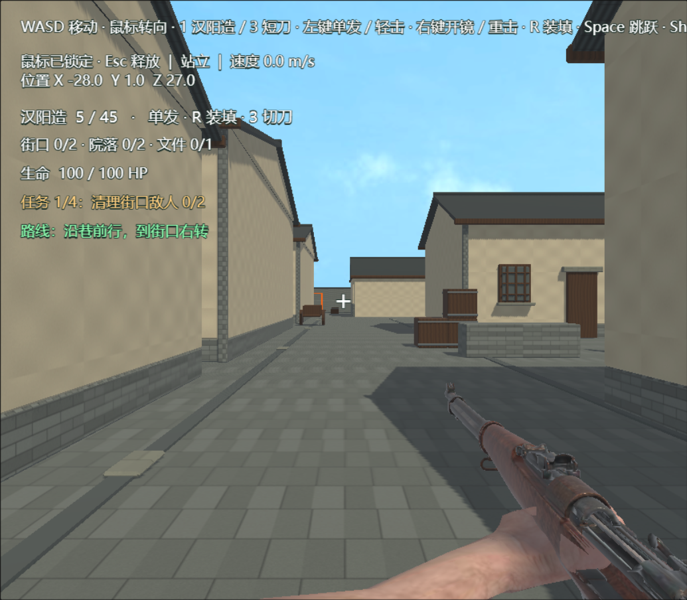
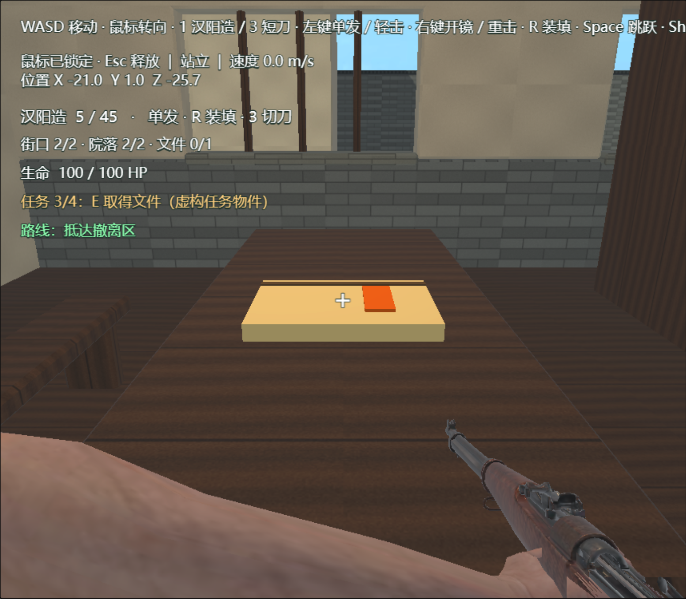

# 松柏巷地图接入 Demo01

在 `0b9bd15` 独立模型交付之后，按用户要求以新地图替换 `assets/Demo01.ls` 的旧地图。目标仍为LayaAir 3.4.1，默认启动配置不变。`Scene.ls`、角色与武器资产、战斗及任务逻辑未更改；`LevelController.ts` 仅把文件位置提示从“储物箱”改为“木桌”。

## 接入内容

- 删除Demo01中的旧地面、灰盒建筑、前后两组旧城装饰及旧路线地面标线，防止重叠显示和重复碰撞。
- `Songbaix_Environment` 引用5个由本机3.4.1 IDE实际解包生成的原生`.lh`预制体；对应`.lm`、`.lmat`、贴图及`.meta`一起交付。原始GLB与Blender源保留。
- `Songbaix_StaticCollisions` 保存81个原生静态BoxCollider：原模型代理57个，另补箱子、门廊、桌椅、柜架和室内顶面等必要阻挡。代理本身不显示。
- `mission-building-game.glb` 是原任务建筑的运行变体，仅排除四个不可交互的纸张占位节点，保留现有任务文件作为唯一可拾取文件。用户拿走文件后，桌上不会留下第二份静态文件。
- 更新现有4名敌人、4组巡逻点、出生点、任务文件、终点和7处HUD路线提示；不新增敌人、不改变武器平衡。巡逻继续沿X方向±1.6米。
- 保持明亮检查光照，并为室内补光；没有宣称已完成1927年凌晨的夜景照明。

## 当前引擎坐标（米）

GLB转换后为Y-up：Blender `(X,Y,Z)` 对应引擎 `(X,Z,-Y)`。地标未拉伸，模块均为单位缩放。

| 节点 | X / Y / Z |
| --- | --- |
| 出生点 | -28 / 1.1 / 27 |
| 街口敌人1 | -19 / 0 / 12 |
| 街口敌人2 | -16 / 0 / 9 |
| 院落敌人1 | -3 / 0.02 / -10 |
| 院落敌人2 | 2 / 0.02 / -7 |
| 可拾取文件 | -22.7 / 1.025 / -25.7 |
| 撤离区中心 | -32 / 1 / -36 |

普通街巷与任务建筑依然属于虚构布局。地标资料、照片年代缺口及尺寸估算见[研究记录](map-songbaix-references.md)。

## 实际验证

- **PASS**：IDE场景Schema校验；TypeScript `tsc --noEmit`。
- **PASS**：3.4.1实际预览加载5个地图模块和81个碰撞体；浏览器控制台无错误或警告。
- **PASS**：原生W键向前行走，站立位置保持在地面；向侧墙移动时被挡住，没有穿墙。
- **PASS**：通过原生W键穿过任务建筑前门，落在室内木地板上。
- **PASS**：清敌前按E无法拿文件；通过测试条件清除四人后，未取件进入撤离区仍不能胜利；回到木桌实际按E，文件消失；再进入撤离区触发胜利；重开恢复出生点、四人及文件。
- **PASS**：从入口到门廊、院落、木桌及北巷的静态通路抽样，包含对箱子绕行；四组完整巡逻范围没有与静态阻挡相交。详见 `songbaix-integration-checks.json`。

实机脚本为 `tools/check-songbaix-runtime.js`，通过Playwright控制真实预览。几何检查期间临时停用AI更新，任务检查调用真实受击入口建立清敌条件，并通过临时摆位抵达检查点；所有临时状态随重开消失，不写入关卡。**这不是全图自动实战、难度平衡或枪械回归测试。**

预制体和碰撞均可在IDE中编辑。生成接入补丁的源文件是 `tools/integrate-songbaix.py`，只准备JSON Patch，实际场景写入通过IDE MCP完成。分支继续使用 `codex/songbaix-map-modeling`，不合并或推送master。
