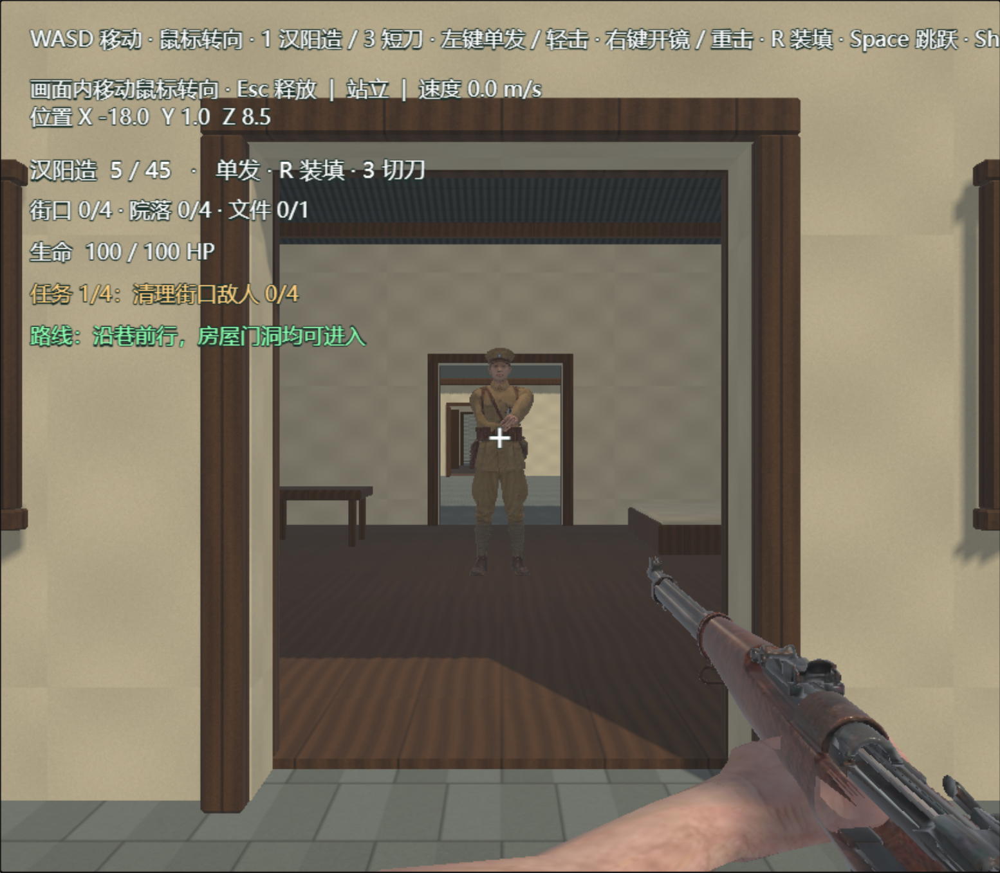
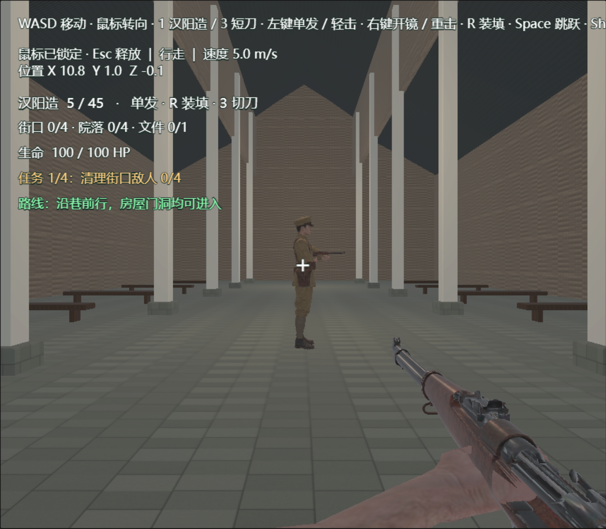
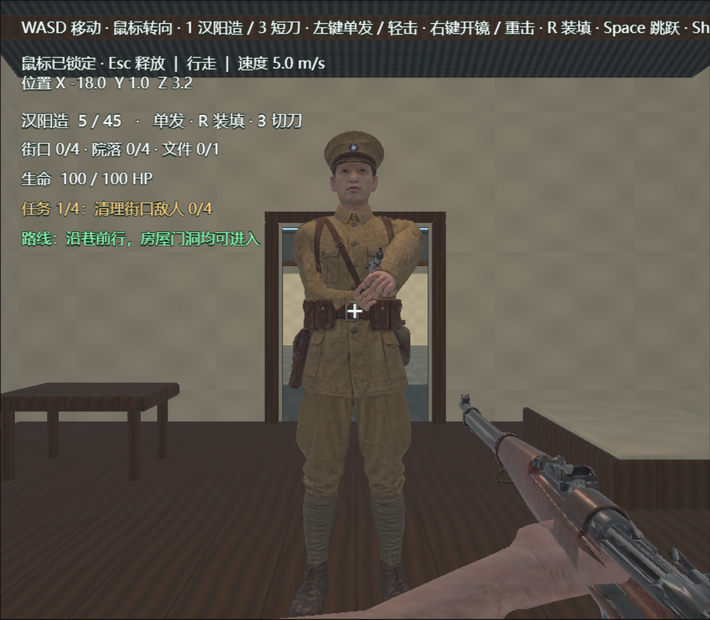

# 可进入室内、门框修复与8名敌人

引擎保持LayaAir 3.4.1；在现有 `codex/songbaix-map-modeling` 分支上继续。原 `Scene.ls`、启动设置、武器与角色资产不变。

## 模型修正

上一版普通民居是整块实心墙体，外侧门板只是外观；本版改为有厚度的空心墙体和真实门洞。7栋民居均有前后通路及朝街侧门，增加木地板、梁架、床、桌和箱子，中心通道留空。门洞净宽2.2米、高2.9米。

教堂保留原有外轮廓，移除实体填充体，五个正面拱门均有实际开口；补齐侧墙、后山墙、地面、内部支柱与简单长凳。主入口3.4米宽。教堂与民居室内都是保守的游戏空间设计，不宣称为1927年实测或真实陈设。原任务建筑也保留可进入状态，共9处建筑内部已检验。

旧门窗压条有交叠表面，运行相机还使用0.01米近裁剪面和1000米远裁剪面，薄表面易出现深度竞争。新版将门框做成真正的洞口饰边：框面和墙面分离，横竖框端部相接而不以共面重叠方式拼接；重新布置任务门框，调整教堂装饰条的前后间距。场景远裁剪面收紧到180米，足以覆盖街区；为保留原有近距离武器显示，没有更改角色控制器的0.01米近裁剪面。没有关闭整个地图的深度测试或遮挡。

源文件仍为 `source-assets/environment/songbaix/Songbaix_Block.blend`。`build_songbaix.py` 调用新增的 `interiors_v2.py` 构建室内；`interior-layout.json` 记录入口。GLB已重新导出，改变的模块已由IDE重新解包，并接回Demo01。源模型可见模块共33,472三角面；最终游戏使用382个静态碰撞体，门洞处使用分段碰撞，不使用会堵住洞口的整栋包围盒。

## 敌人配置

原4名街口/院落敌人保留；另增加4名，继续使用原AI、生命值、武器及±1.6米巡逻范围。

| 新敌人 | 引擎坐标 X/Y/Z | 分组与位置 |
| --- | --- | --- |
| 05 | -18 / 0.05 / 0 | 街区，转角D屋 |
| 06 | -35 / 0.05 / 5 | 街区，西侧C屋 |
| 07 | 20 / 0.08 / 0 | 院区，教堂大厅 |
| 08 | -3 / 0.05 / -29 | 院区，北侧G屋 |

关卡共8名、两组各4名。克隆时全部内部节点ID及眼位、枪口、巡逻点引用一起重映射；任务统计包含全部8名。开始菜单数量改从实际分组读取，HUD及路线提示同步更新。清完八名才可取文件，取件后才能撤离。

## 已执行检查

- **PASS**：Blender源文件重新打开、源网格与法线、UV、材质、6个GLB重导入及尺寸检查。
- **PASS**：IDE场景结构校验、TypeScript检查、场景ID唯一及引用完整、8名敌人完整巡逻范围对静态碰撞的间隙检查。
- **PASS**：3.4.1预览中用原生W键逐一进入A～G七栋民居、教堂及任务建筑；落地高度与各自地板一致。脚本通过临时摆位靠近入口并停用AI攻击，实际过门使用原生角色移动与碰撞。
- **PASS**：加载8名敌人；未清敌不能取件，清敌后实际按E取件，未取件不能撤离，取件后胜利，重开恢复8名敌人和文件。清敌使用测试受击入口，未进行完整实战或难度平衡验证。
- **PASS（抽查范围）**：D屋门框正视与左右12度视角检查未见原来的交叠破面。相同静止视点间隔0.6秒，对门框区域80×700像素比较，168,000个RGB通道均未发生变化。该结果只代表已检查视点，不等于穷举所有视角/显卡。
- 浏览器预览控制台无错误或警告。实机数据见 `songbaix-interiors-checks.json`；不把Blender渲染图当作实机证明。

